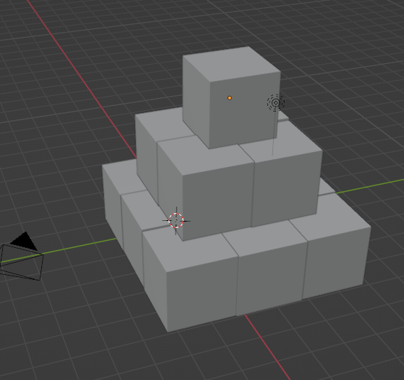

# Simulación para Computadoras

## Descripción
Este repositorio contiene los programas de la materia de Simulación para Computadoras.

## Práctica 1
🔼 En esta práctica hicimos un modelado 3D de una pirámide hecha de cubos.

Imágenes del modelo:

    
    

## Práctica 3
🔮 En esta práctica hicimos un modelado 3D de un personaje del juego Crossy Roads, yo hice el modelado del mago.

Imágenes del modelo:

    
    

