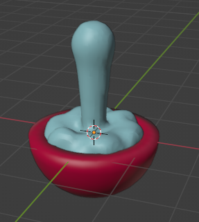

# 💧 Práctica 5

En esta práctica se implementó una simulación de líquidos en bajos polígonos usando un programa de modelado 3D.

Imágenes del modelo:

    

https://github.com/x4nemi/simulacion_por_computadora_ximena_garcia/assets/70961966/87c9f0e9-3b55-4dc5-a18a-6264a654aba2

