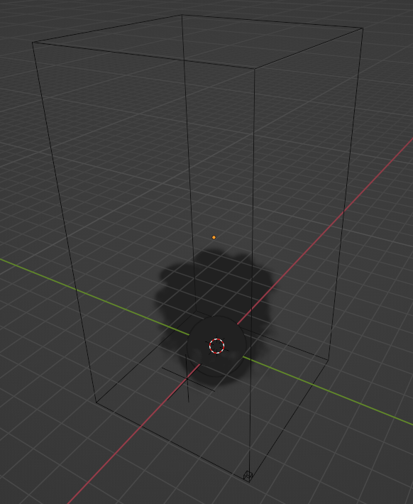

# 💨🔥 Práctica 6

En esta práctica se implementó una simulación simulación de humo y fuego basado en bajos polígonos usando un programa de modelado 3D.

Imágenes del modelo:

    

https://github.com/x4nemi/simulacion_por_computadora_ximena_garcia/assets/70961966/f4c2a0a9-aa7e-46bd-8028-f68dbcd38d9d

